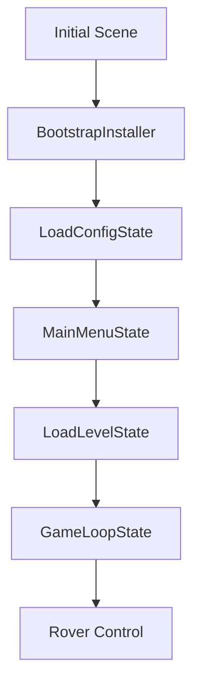

# 🚀 Rover Test Task

[](https://unity3d.com/get-unity/download)
[](https://docs.microsoft.com/en-us/dotnet/csharp/)
[](./LICENSE)

> 3D rover control simulator with realistic physics and multiple input device support

## 💫 Live Demo

_(not specified)_

## 📖 Project Description

**Rover Test Task** is a 3D rover control simulator developed in Unity. The project demonstrates implementation of:

- **Realistic vehicle physics** using Unity's WheelCollider system
- **Flexible input system** with keyboard and gamepad support
- **Modern architecture** utilizing State Machine and Dependency Injection patterns
- **Optimized resource loading** through Unity Addressables

This project is designed to showcase Unity development skills and can serve as a foundation for more complex vehicle simulators.

## 📋 Table of Contents

- [Technologies](#-technologies)
- [Installation & Setup](#-installation--setup)
- [Project Structure](#-project-structure)
- [Features](#-features)
- [Controls](#-controls)
- [Architecture](#-architecture)
- [License](#-license)
- [FAQ](#-faq)
- [Author](#-author)

## 🛠 Technologies

### Core Technologies
- **Unity Engine** `6000.1.8f1` — game engine
- **C#** `9.0` — programming language
- **Universal Render Pipeline (URP)** `17.1.0` — rendering pipeline

### Architecture & Patterns
- **Zenject (Extenject)** `9.2.0` — Dependency Injection framework
- **State Machine Pattern** — game state management
- **Service Locator Pattern** — service access
- **Factory Pattern** — game object creation

### Unity Packages
- **Addressables** `2.6.0` — asynchronous resource loading
- **Input System** `1.14.2` — modern input system
- **Mathematics** `1.3.2` — optimized mathematical operations
- **Timeline** `1.8.9` — animation and cinematography system
- **Post Processing** `3.4.0` — image post-processing

### Development Tools
- **Cursor IDE** — code editor integration
- **Unity Test Framework** `1.5.1` — unit testing

## 🚀 Installation & Setup

### Requirements
- **Unity Hub** latest version
- **Unity Editor** `6000.1.8f1` or newer
- **Git** for repository cloning

### Installation

1. **Clone the repository:**
   ```bash
   git clone https://github.com/your-username/Rover-Test-Task.git
   cd Rover-Test-Task
   ```

2. **Open project in Unity:**
   ```bash
   # Through Unity Hub
   # Add Project → select project folder
   
   # Or via command line
   "C:\Program Files\Unity\Hub\Editor\6000.1.8f1\Editor\Unity.exe" -projectPath "project_path"
   ```

3. **Wait for package import:**
   - Unity will automatically download all dependencies from `Packages/manifest.json`
   - Addressables will be configured automatically

4. **Run the project:**
   - Open scene `Assets/Scenes/Initial.unity`
   - Press **Play** button in Unity Editor

### Building the Project

```bash
# Through Unity Editor:
# File → Build Settings → Build
# Or File → Build Settings → Build and Run
```

## 📁 Project Structure

```
Assets/
├── 📂 Addressables/           # Addressable resources
│   ├── LevelAssets/          # Level resources
│   ├── Models/               # 3D models and materials
│   └── UI/                   # UI prefabs
├── 📂 Scenes/                # Unity scenes
│   ├── Initial.unity         # Bootstrap scene
│   ├── MainMenu.unity        # Main menu
│   └── Level.unity           # Game level
├── 📂 Scripts/               # C# source code
│   ├── 🏗️ Infrastructure/    # Architectural components
│   │   ├── AssetManagement/  # Resource management
│   │   ├── Installers/       # DI containers
│   │   └── States/           # State Machine
│   ├── 🎮 Logic/             # Game logic
│   │   ├── Rover.cs         # Rover controller
│   │   └── CameraFollow.cs  # Following camera
│   ├── ⚙️ Services/          # Application services
│   │   ├── InputManager/    # Input system
│   │   ├── SceneLoader/     # Scene loading
│   │   └── GameFactory/     # Object factory
│   ├── 📊 ScriptableObjects/ # Data configuration
│   └── 🎨 UI/               # User interface
├── 📂 Settings/              # Unity settings
├── 📂 Resources/             # Unity resources
└── 📂 Plugins/               # External plugins
    └── Zenject/             # Zenject DI framework
```

## ✨ Features

### 🎮 Vehicle Control
- **Realistic physics** using Unity WheelCollider system
- **All-wheel drive** — all four wheels receive power
- **Braking system** with automatic brakes when no input is detected
- **Front wheel steering** with configurable steering angle

### 🎯 Input System
- **Keyboard** — WASD/arrow keys for control
- **Gamepad** — left stick for acceleration/braking, right stick for steering
- **Runtime switching** between input devices
- **Unified interface** for all input types

### 📷 Camera
- **Following camera** with smooth movement
- **Dynamic positioning** relative to rover
- **Smooth rotation** for comfortable gameplay
- **Fixed viewing angle** for optimal perception

### 🏗️ Architecture
- **State Machine** for state management (menu, loading, game)
- **Dependency Injection** via Zenject for loose coupling
- **Asynchronous loading** of resources through Addressables
- **Modular structure** with clear separation of concerns

### 🎨 Visual
- **Universal Render Pipeline** for modern graphics
- **Post-processing effects** for enhanced visuals
- **3D environment** with detailed models
- **Wheel synchronization** — visual models synchronized with physics

## 🎮 Controls

### Keyboard
- **W/S or ↑/↓** — accelerate/brake
- **A/D or ←/→** — turn left/right

### Gamepad
- **Left stick (Y)** — accelerate/brake
- **Right stick (X)** — turn left/right

### Menu
- **Mouse buttons** for UI navigation
- **Input device switching** in main menu
- **Exit** — quit application

## 🏗️ Architecture

### Design Patterns

1. **State Machine Pattern**
   ```csharp
   // Game state management
   LoadConfigState → MainMenuState → LoadLevelState → GameLoopState
   ```

2. **Dependency Injection**
   ```csharp
   // Zenject container in BootstrapInstaller
   Container.Bind<IInputManagerService>().To<InputManagerService>().AsSingle();
   ```

3. **Factory Pattern**
   ```csharp
   // GameFactoryService creates game objects
   await _gameFactory.CreateRover(spawnPosition, roverConfig);
   ```

4. **Service Locator**
   ```csharp
   // Service access through interfaces
   public class Rover : MonoBehaviour
   {
       private IInputManagerService _inputManager;
   }
   ```

### Execution Flow



## 📄 License

This project is licensed under the [MIT License](./LICENSE).

## ❓ FAQ

### Q: How to add a new input device?
A: Create a class inheriting from `BaseInputManager` and add it to `InputManagerService.Switch*()` methods.

### Q: How to change rover parameters?
A: Edit the `RoverConfig` ScriptableObject in the Resources folder or create a new configuration file.

### Q: How to add a new level?
A: Create a new scene, add it to Build Settings, and update `AssetAddress` for loading through Addressables.

### Q: Why use Zenject instead of Unity's built-in DI?
A: Zenject provides a more flexible dependency injection system with support for complex initialization scenarios.

### Q: Can the project be ported to mobile platforms?
A: Yes, but it will require input system adaptation for touch devices and performance optimization.

## 👨‍💻 Author

**Rover Development Team**

- 🌐 Website: _(not specified)_
- 📧 Email: _(not specified)_
- 💼 LinkedIn: _(not specified)_
- 🐱 GitHub: _(not specified)_

---

<div align="center">

**Made with ❤️ to showcase Unity development skills**

[⬆ Back to top](#-rover-test-task)

</div>